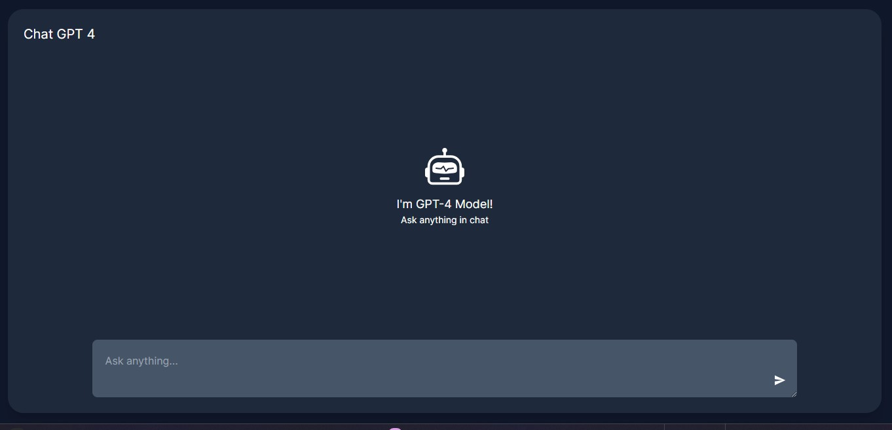

# Setup 

- clone the this repo
- goto `chat-gpt4-vercel` project 
- create `.env.local` environment
- add your goto `openai` create api key add it to `OPENAI_API_KEY`
- run the project `npm run dev`

 # screenshot

### ❤️ I'm Rajashekhar  
